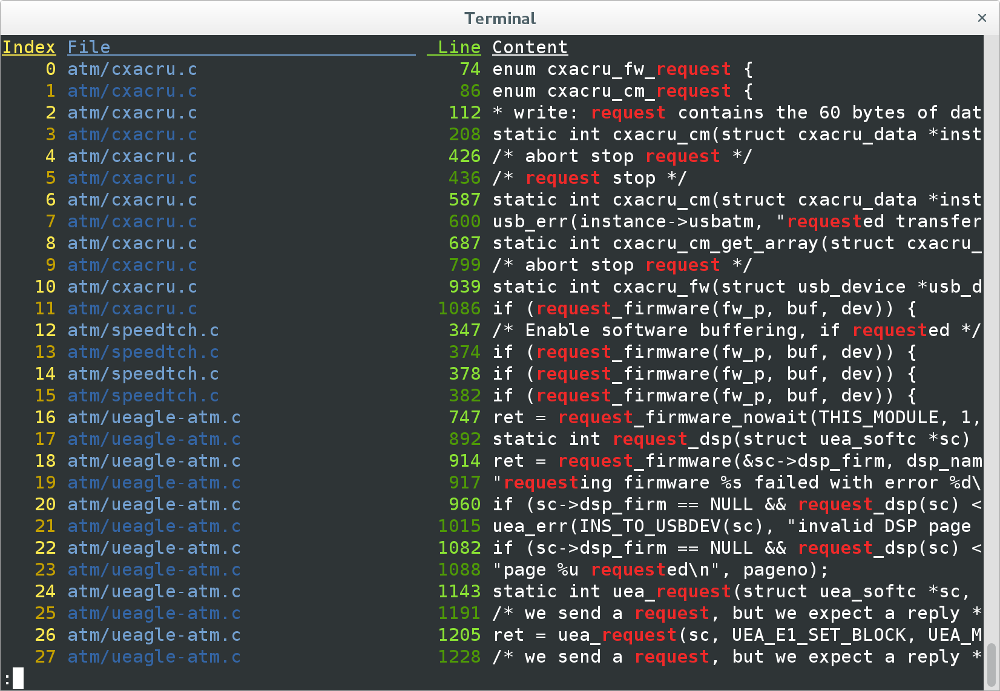
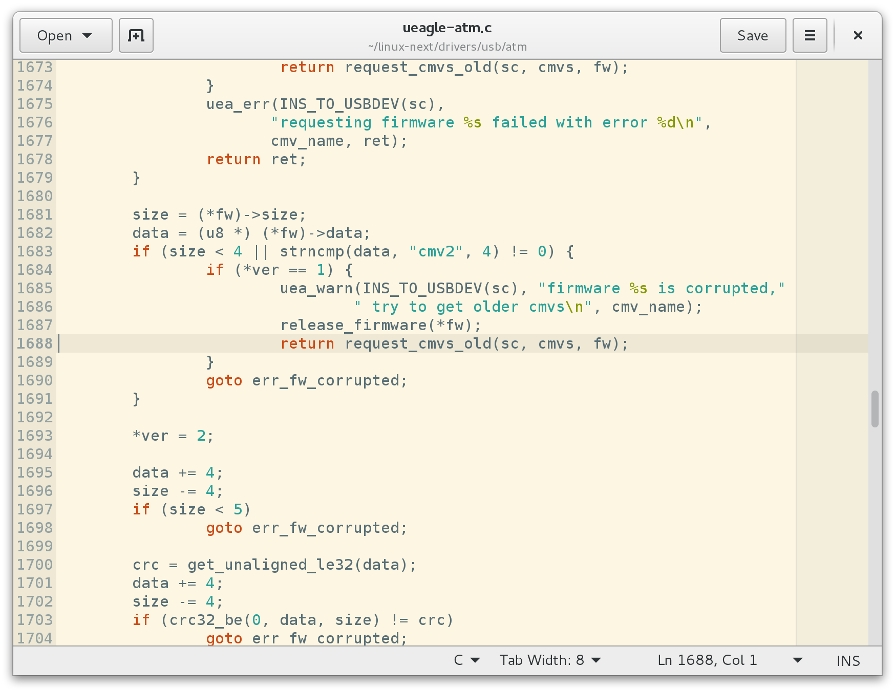
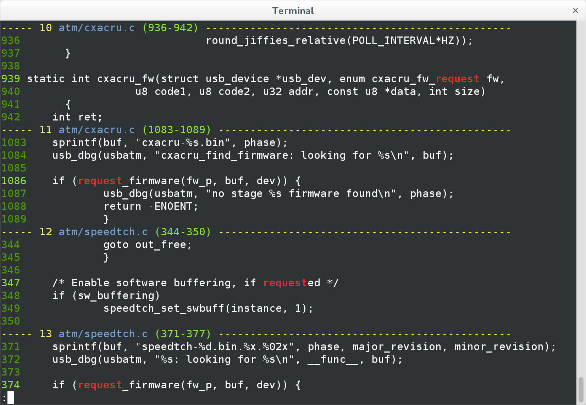

#vgrep

**vgrep** is a tool to search strings in a given source tree.  It is inspired by **cgvg**, but faster by using *git*, and extended to perform further operations on the matches (e.g., opening in an editor, listing matched files, etc.).

Feedback & patches are always welcome.  Feel free to copy, improve, distribute and share.

##Usage Example

###Searching a Symbol

- **vgrep SYMBOL** to search *SYMBOL* in your current directory.  You can also specify multiple symbols that you may search for.

- The output has the format "**Index** **File** **Line** **Content**".  The index can later be used to open the specific location in an editor.  Matches are highlighted in the content lines.

- The results are cached, so you can run vgrep without arguments to see the results of the last query.

An example call could look as follows:

``` bash
[~/linux-next/drivers/usb]$ vgrep request
```



###vgrep-Specific Options

- **'--no-git'** to use to *grep* instead (required outside a Git repository).

- **'--no-git-submodules'** to not recurse into Git submodules.  Git submodule search is only useful within a Git Repository (see --no-git).

- **'--no-header'** to compress the whitespace a bit to help fit more information on each line.  This option is helpful if you are working on a terminal with few columns, or have long filenames or paths to search.

###grep-Specific Options

- Note that **all** non-vgrep specific options/arguments will be passed to *git grep* or *grep*.  To give a few examples:

- **vgrep -w FOO** will match *FOO* only at word boundaries.  Since vgrep has no option *-w* it will be passed to (git) grep respectively.

- **vgrep FOO -- "*.c"** to grep only in .c files.

- Please refer to (git) grep manuals for further information.

###Show Indexed Location

To visit a specific location pass **'--show INDEX'**.  vgrep will then open the location pointed to by *INDEX* with the editor that is set in your *enviroment*.  vgrep defaults to *vim* if the *EDITOR* environment variable is not set.

```
[~/linux/kernel/irq]$ export EDITOR=gedit
[~/linux/kernel/irq]$ vgrep --show 40
```



##vgrep Commands

Once vgreped, you can perform certain operations on the results (via the **'--show'** option) such as limiting the range of displayed hits, listing matched files, etc.  Thanks to [stettberger](https://github.com/stettberger) for adding this functionality to vgrep.

```
help: <Selector><Cmd>
      Selector:  `3' (one) `5,23' (mult.) `7-10' (range) `/ker.el/' (regex)
      Cmd:  print, show, context, tree, delete, files, quit,
      E.g.: 40,45s -- show matches 40 and 45 in $EDITOR
```

###Showing the Directory Tree

The directory tree with a summary of all matches in the respective directory can be shown with **'--show t'**.


###Showing Context Lines

Sometimes it is helpful to see the context of matching lines.  Use **'--show c N'** to see *N* context lines.  Note that the displayed source code is highlighted when the **pygments** package is installed (e.g., ```pip3 install pygments```).


